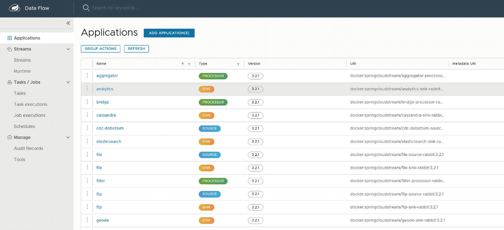

# Spring Cloud Function and Spring Cloud Data Flow and Spring Cloud Streams
Spring Cloud Data Flow (SCDF) is a Spring.io-based product that supports the creation and deployment of a data pipeline. It supports batch and event-driven data, which makes it versatile. SCDF pipelines can be built programmatically or wired up through a GUI. It is heavily based on the Spring Framework and Java, which makes it very popular among Spring developers.

Figure 4-3 shows a sample dashboard of SCDF with a simple data pipeline that has a source, a processor, and a sink. You can drag-and-drop from the available components to build the pipeline. You can also build your custom source, processors, and sinks and deploy them for use within your enterprise.


As you can see from the dashboard, you can build stream-based or batch-based (task) data pipelines and manage these through a single dashboard.

SCDF, unlike other the data pipeline tools available in the cloud, can be deployed in a Kubernetes, Docker, or Cloud Foundry environment, making it a portable tool for data pipeline development and deployment.

## Spring Cloud Function and SCDF
Spring Cloud Function and SCDF are perfectly matched, as they are built out of the same framework, Spring. You can deploy Spring Cloud Function as a source, processor, sink, or as a trigger for the pipeline. Since the data pipelines are usually invoked sporadically for processing data, you can optimize utilization of resources and costs with a Spring Cloud Function.

Let’s look at a sample implementation of Spring Cloud Function with SCDF.

In this example, you will build a simple data pipeline using RabbitMQ as a source, do a simple transformation, and store the messages in a log. You will publish sample vehicle information into a RabbitMQ topic called VehicleInfo and do a simple transformation, then store it in a log file.

RabbitMQ ➤ Transform ➤ Log

Prerequisites:
* SCDF deployed on Kubernetes or locally in Docker
* Kubernetes or Docker
* A RabbitMQ cluster/instance
* A queue to publish messages
* Code from GitHub at https://github.com/banup-kubeforce/SCDF-Rabbit-Function.git
  * Additional prerequisites for each environment can be found at https://dataflow.spring.io/docs/installation

### Step 1: Installing Spring Cloud Data Flow.
* Local machine: Docker Compose is an easy way to get an instance of Spring Cloud Data Flow up and running. The details of the installation are available at https://dataflow.spring.io/docs/installation/local/docker/
* Kubernetes: Instructions for installing this on Kubernetes are available athttps://dataflow.spring.io/docs/installation/kubernetes/.

For this example, I used an existing cluster that I created in Chapter 2 and ran the following helm command to install the SCDF, which results in the output shown in Figure 4-4.
```bash
kubectl create ns scdf-system
helm install scdf bitnami/spring-cloud-dataflow -n scdf-system \
    --set server.service.type=LoadBalancer \
    --set server.service.loadBalancerIP=${ingress} \
    --set server.ingress.enabled=true \
    --set server.ingress.server.host=scdf.${ingress}.xip.io
```

```bash
NAME: scdf
LAST DEPLOYED: Sun Dec 15 00:52:01 2024
NAMESPACE: scdf-system
STATUS: deployed
REVISION: 1
TEST SUITE: None
NOTES:
CHART NAME: spring-cloud-dataflow
CHART VERSION: 34.1.0
APP VERSION: 2.11.5

Did you know there are enterprise versions of the Bitnami catalog? For enhanced secure software supply chain features, unlimited pulls from Docker, LTS support, or application customization, see Bitnami Premium or Tanzu Application Catalog. See https://www.arrow.com/globalecs/na/vendors/bitnami for more information.

** Please be patient while the chart is being deployed **

Spring Cloud Data Flow chart was deployed enabling the following components:

- Spring Cloud Data Flow server
- Spring Cloud Skipper server
```
> Figure 4-4Successful execution of a helm chart for SCDF

Once the command runs successfully, as shown in Figure 4-4, you can check the status by running `kubectl get pods`. You can also get the external IP with the `kubectl get svc` commands, as shown in Figures 4-5 and 4-6.

```bash
$ kubectl get pods -n scdf-system

NAME                                                  READY   STATUS    RESTARTS   AGE
scdf-mariadb-0                                        1/1     Running   0          5m49s
scdf-rabbitmq-0                                       1/1     Running   0          5m49s
scdf-spring-cloud-dataflow-server-78c6f74d64-8xn7s    1/1     Running   0          5m49s
scdf-spring-cloud-dataflow-skipper-5d554b5796-jmhdp   1/1     Running   0          5m49s
```
> Figure 4-5 Get the external IP of the SCDF
  


```bash
$ kubectl get svc -n scdf-system

NAME                                 TYPE           CLUSTER-IP      EXTERNAL-IP   PORT(S)                                 AGE
scdf-mariadb                         ClusterIP      10.107.47.248   <none>        3306/TCP                                7m9s
scdf-mariadb-headless                ClusterIP      None            <none>        3306/TCP                                7m9s
scdf-rabbitmq                        ClusterIP      10.99.175.113   <none>        5672/TCP,4369/TCP,25672/TCP,15672/TCP   7m9s
scdf-rabbitmq-headless               ClusterIP      None            <none>        4369/TCP,5672/TCP,25672/TCP,15672/TCP   7m9s
scdf-spring-cloud-dataflow-server    LoadBalancer   10.99.172.63    <pending>     8080:31673/TCP                          7m9s
scdf-spring-cloud-dataflow-skipper   ClusterIP      10.110.59.58    <none>        80/TCP                                  7m9s
```
> Figure 4-6 Get the status of SCDF

> minikube using loadbalancer:  https://minikube.sigs.k8s.io/docs/handbook/accessing/#loadbalancer-access
> Services of type `LoadBalancer` can be exposed via the `minikube tunnel` command. It must be run in a separate terminal window to keep the `LoadBalancer` running. Ctrl-C in the terminal can be used to terminate the process at which time the network routes will be cleaned up.
> ```bash
> $ minikube -p sandbox  tunnel
> $ minikube -p sandbox dashboard
> ```
> Note that without minikube tunnel, Kubernetes will show the external IP as “pending”.
> ```bash
> $ kubectl get svc -n scdf-system
> NAME                                 TYPE           CLUSTER-IP      EXTERNAL-IP   PORT(S)                                 AGE
> scdf-mariadb                         ClusterIP      10.107.47.248   <none>        3306/TCP                                12m
> scdf-mariadb-headless                ClusterIP      None            <none>        3306/TCP                                12m
> scdf-rabbitmq                        ClusterIP      10.99.175.113   <none>        5672/TCP,4369/TCP,25672/TCP,15672/TCP   12m
> scdf-rabbitmq-headless               ClusterIP      None            <none>        4369/TCP,5672/TCP,25672/TCP,15672/TCP   12m
> scdf-spring-cloud-dataflow-server    LoadBalancer   10.99.172.63    10.99.172.63  8080:31673/TCP                          12m
> scdf-spring-cloud-dataflow-skipper   ClusterIP      10.110.59.58    <none>        80/TCP                                  12m
> ```

You can now access SCDF using the external IP. For example, http://10.99.172.63:8080/dashboard

> In Google Anthos SandBox ,minikube using docker-ubuntu-vnc-desktop
> ```bash
> $ docker run --rm --network=host   ghcr.io/robert0714/docker-ubuntu-vnc-desktop:latest
> ```
> You can using port is `6080` web-portforward to see the inner browser `firefox` .

The next step is to add applications. Spring provides a standard set of templates that you can use to build your pipeline.

### Step 2: Add Applications to your SCDF Instance

Use the Add Application(s) button to create some starter apps that you can use to create a data pipeline; see Figures 4-7 and 4-8.

> Figure 4-7 Add application view in SCDF


> Figure 4-8 Pick the starters of your choice. If SDCF is deployed in Kubernetes, pick Docker based starters

Figure 4-8 shows you the options to add applications that are custom built through the Registering One or More Applications option. You import the application coordinates from an HTTP URI or use a properties file. There is also an option to import some prebuilt starters from Spring. Furthermore, you can choose starters that are Maven- or Docker-based or RabbitMQ- or Kafka-based. RabbitMQ and Kafka are used as backbone messaging systems for internal SCDF components and not for external use. When deploying to a Kubernetes cluster, you have to choose a Docker-based starter. When deploying locally in a Docker environment, you can choose between Maven and Docker-based starters.

Figure 4-9 shows prebuilt templates with the Docker images URI. SCDF is running on a Kubernetes environment, so the prebuilt images have a Docker URI.


> Figure 4-9 Prebuilt templates are installed in SCDF

These prebuilt templates come in three categories—source, processor, and sink. They allow you to wire up a data pipeline without the need for coding. If you want a custom component, you can follow the examples in https://dataflow.spring.io/docs/stream-developer-guides/.

The next step is to create a stream using the starter templates you loaded.

### Step 3: Create a Stream

The Streams dashboard allows you to wire up a data pipeline. Click the Create Streams button to start the process, as shown in Figure 4-10.


> Figure 4-10 The Streams dashboard

Then perform the following steps:
1. Pick the source.  
   This example uses a RabbitMQ as the source, so pick Rabbit from the available options, as shown in Figure 4-11.
    
    > Figure 4-11 Create a source
2. Pick a processor.   
   Pick the Transform component from the list, as shown in Figure 4-12.   
    
    > Figure 4-12 Create a processor
3. Pick a sink.    
   Pick the Log component from the list, as shown in Figure 4-13.  
   
   > Figure 4-13 Create a sink

   Now you wire them by dragging from the output of the first component to the input of the second component, as depicted in Figure 4-14.  
   
   > Figure 4-14 Wiring the data pipeline

   The next step is to configure the pipeline.

4. Configure RabbitMQ.
   You have to point the Rabbit source to your RabbitMQ instance. There are three categories in the form to populate. Open and fill in the appropriate fields. I used username, password, port, host, and queue, as shown in Figure 4-15.

   
   > Figure 4-15 Set the properties for rabbit

   Click Update once you’re done with the configuration.

5. Configure the transform.
   In this example, you simply transform the incoming string to uppercase. Note that you have to use SpEL (Spring Expression Language). More information on SpEL Is available at https://docs.spring.io/spring-framework/docs/3.0.x/reference/expressions.xhtml. See Figure 4-16.   
   
   > Figure 4-16 Set the transform properties
6. Configure the sink.
   In this case, you just use a simple log. No configuration is required. See Figure 4-17.   
   
   > Figure 4-17 Setting properties for the log
7. Wire up the data pipeline.
   Once you wire up, you will get a data pipeline. This will also show a Stream DSL (Domain Specific Language) expression that you can save and reuse using a SCDF shell or dashboard, as shown in Figure 4-18.
   ```bash
   rabbit --password=pa55word --port=5672 --host=20.40.208.246 --username=banup --queues=VehicleInfo | transform --expression='new String(payload).toUpperCase()' |log
   ``` 
   
   > Figure 4-18 Wire up the data pipeline

   The pipeline can be triggered by an external Spring Cloud Function on Lambda or using Google Cloud Functions, and so on. See Figure 4-19.
8. Deploy the stream   
   
   > Figure 4-19 Successful deployment of a data pipeline

###  Step 4: Create a function to publish data to RabbitMQ

Here, you create a Spring Cloud Function to publish the data to start the data-pipeline process.

The components that you will create are as follows:
* SenderConfig
* QueueSender
* SenderFunction
  * Prerequisites:
    A POM with the necessary dependencies for RabbitMQ and Spring Cloud Functions, as shown in Listing 4-1.
    ```xml
    <dependencies>
        <dependency>
            <groupId>org.springframework.boot</groupId>
            <artifactId>spring-boot-starter-data-jpa</artifactId>
        </dependency>
        <dependency>
            <groupId>org.springframework.boot</groupId>
            <artifactId>spring-boot-starter-web</artifactId>
        </dependency>
        <dependency>
            <groupId>org.springframework.boot</groupId>
            <artifactId>spring-boot-starter-amqp</artifactId>
        </dependency>
        <dependency>
            <groupId>org.springframework.cloud</groupId>
            <artifactId>spring-cloud-function-web</artifactId>
        </dependency>
        <dependency>
            <groupId>org.springframework.boot</groupId>
            <artifactId>spring-boot-starter-test</artifactId>
            <scope>test</scope>
        </dependency>
    </dependencies>
    <dependencyManagement>
        <dependencies>
            <dependency>
                <groupId>org.springframework.cloud</groupId>
                <artifactId>spring-cloud-dependencies</artifactId>
                <version>${spring-cloud.version}</version>
                <type>pom</type>
                <scope>import</scope>
            </dependency>
    </dependencyManagement>
    ```
    > Listing 4-1pom.xml with RabbitMQ Dependencies

    Add the RabbitMQ server and configuration references to the `application.properties` file, as in Listing 4-2.
    ```properties
    spring.cloud.function.definition=senderFunction
    spring.rabbitmq.host=20.40.208.246
    spring.rabbitmq.port=5672
    spring.rabbitmq.username=banup
    spring.rabbitmq.password=pa55word
    queue.name=VehicleInfo
    ```
    > Listing 4-2 application.properties

1. **Create the SenderConfig Component**
   This is a simple setter for the queue name. You can expand this to include other RabbitMQ configurations. This is the entity definition (see [Listing 4-3](./src/main/java/com/kubeforce/scdfrabbitfunction/SenderConfig.java)).  
2. **Create the QueueSender Component**
   You use a RabbitTemplate from the springframework amqp library to define the connection to the RabbitMQ instance (see [Listing 4-4](./src/main/java/com/kubeforce/scdfrabbitfunction/QueueSender.java)).
3. **Wrap the Sender in Spring Cloud Function framework**
   This example uses the queueSender to send the data (see [Listing 4-5](./src/main/java/com/kubeforce/scdfrabbitfunction/SenderFunction.java)).

### Step 5: Test the function using Postman

Use the `GET` function on Postman and provide the URL to the `senderFunction`.      
   
  You should get the result shown in this image.
  Check the RabbitMQ queue for any messages.  
    

  Now you have a function that can post messages to a RabbitMQ topic. The SCDF data pipeline will be listening to the queue and will start processing.
  You can also look at the logs associated with each of the components to monitor the status of the data pipeline, as shown in Figure 4-20.
  
  > Figure 4-20 Details of the VehicleDataPipeline stream

You have seen how to create a data pipeline in SCDF that monitors a topic in RabbitMQ. You created a Spring Cloud Function that posts messages into the RabbitMQ topic. Spring Cloud Function can also be deployed as a source in SCDF; more information on how to develop code for SCDF is available on the SCDF site.  